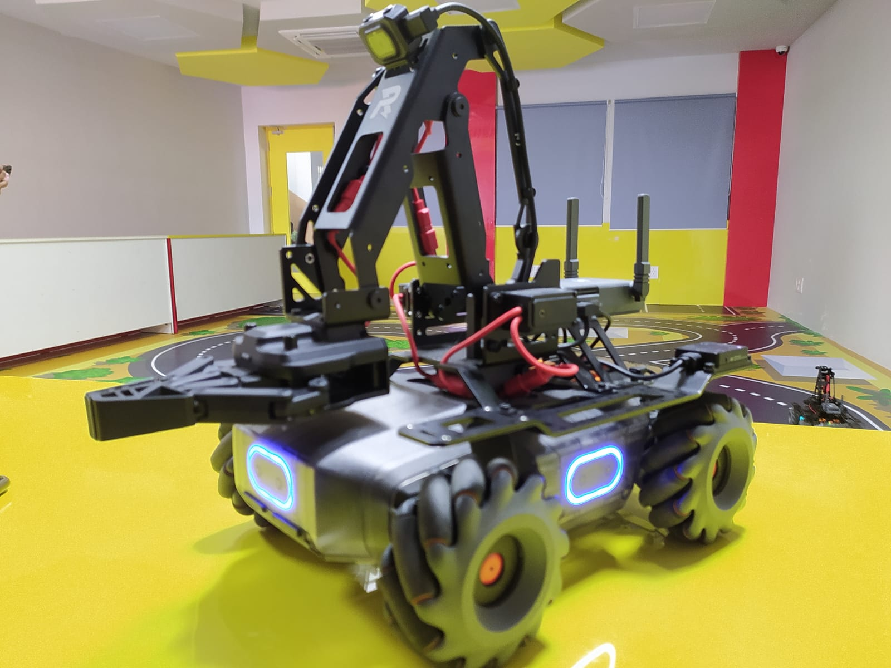
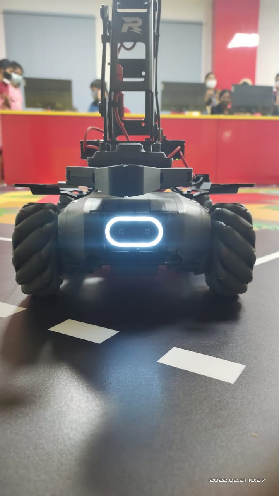

# MobileRobot-Openloopcontrol
## Aim:

To develop a python control code to move the mobilerobot along the predefined path.

## Equipments Required:
1. RoboMaster EP core
2. Python 3.7

## Procedure

Step1: Initiate the MobileRobot.

<br/>

Step2: Connect your PC with the MobileRobot through Wi-Fi.

<br/>

Step3: Open batter_level.py file and check the battery.

<br/>

Step4: Open the other Python files and Program the movements of the robot using python.

<br/>

Step5: Execute the python program and record the movements.

<br/>

## Program :
```python
from robomaster import robot
import time

if __name__ == '__main__':
    ep_robot = robot.Robot()
    ep_robot.initialize(conn_type="ap")

    ep_chassis = ep_robot.chassis

    '''
    x = x-axis movement distance,( meters) [-5,5]
    y = y-axis movement distance,( meters) [-5,5]
    z = rotation about z axis ( degree)[-180,180]
    xy_speed = xy axis movement speed,( unit meter/second) [0.5,2]
    '''
    ep_chassis.move(x=2, y=0, z=0, xy_speed=0.75).wait_for_completed()
     ep_led.set_led(comp="all",r=255,g=0,b=0,effect="on")   

    ep_chassis.move(x=0, y=0, z=90, xy_speed=1).wait_for_completed()
    ep_led.set_led(comp="all",r=0,g=255,b=0,effect="on")

    ep_chassis.move(x=2, y=0, z=0, xy_speed=0.75).wait_for_completed()
    ep_led.set_led(comp="all",r=0,g=0,b=255,effect="on")

    ep_chassis.drive_speed(x=0.5,y=0,z=20)
    time.sleep(20)
    ep_chassis.drive_speed(x=0,y=0,z=0)

    
    ep_robot.close()
```

## MobileRobot Movement Image:


Initial Position :
Final Position

<br/>
<br/>
<br/>
<br/>

## MobileRobot Movement Video:

[Click here..](https://youtube.com/shorts/xCajyThrivk?feature=share)

<br/>
<br/>


## Result:
Thus the python program code is developed to move the mobilerobot in the predefined path.


<br/>
<br/>

```
Mobile Robotics Laboratory
Department of Artificial Intelligence and Data Science/ Machine Learning
Saveetha Engineering College
```
